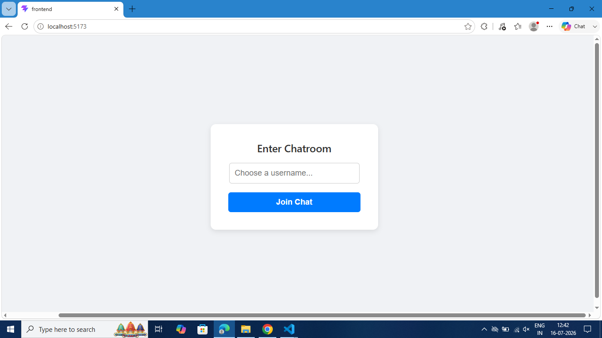
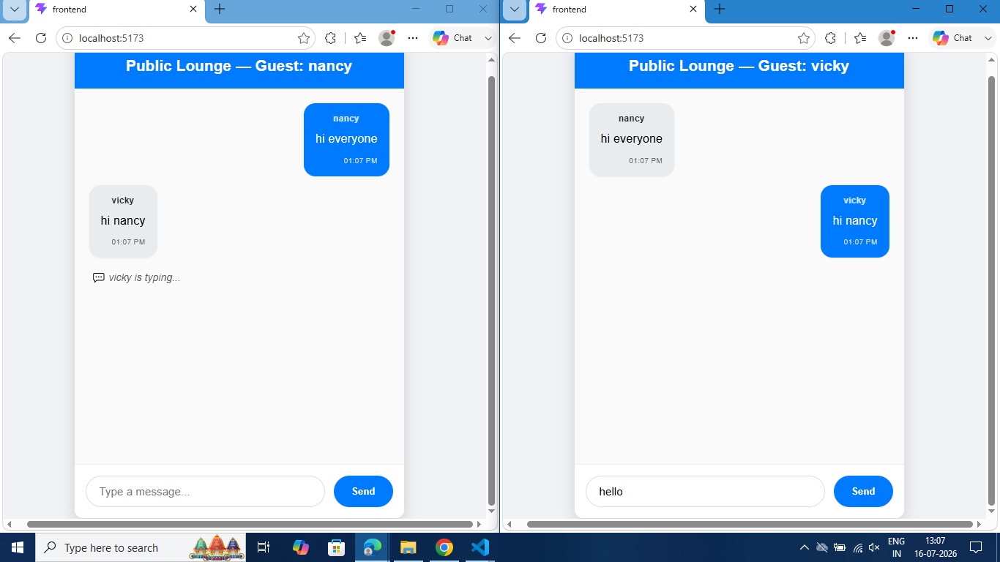

# 💬 Full-Stack Real-Time Chat Application

A clean, responsive real-time chat application built with modern web technologies for seamless communication.

**Frontend:** React (Vite) | **Backend:** Node.js + Express + Socket.io

---

<!-- Screenshots inserted before Key Features -->
## 🖼️ Screenshots

| Join Chat | Group Chat |
|---:|:---|
|  |  |

> Click an image to open the full video file if you want to see the live demo: [chat-app.mp4](./video/chat-app.mp4)

---

## ✨ Key Features

- 🔄 **Real-Time Messaging** - Instant message delivery using WebSockets
- 👤 **Username-Based Login** - Simple authentication gateway
- ✍️ **Live Typing Indicator** - See when others are typing with auto-timeout
- 💾 **Chat History** - Messages persist during your session
- 📱 **Responsive Design** - Works beautifully on all screen sizes

---

## 🚀 Quick Start

**Prerequisites:** [Node.js](https://nodejs.org/) must be installed

### Backend Setup

```bash
# Navigate to backend directory
cd backend

# Install dependencies
npm install

# Start the server
node server.js
```

✅ Backend runs at **http://localhost:3001**

### Frontend Setup

```bash
# Open a NEW terminal and navigate to frontend
cd frontend

# Install dependencies
npm install

# Start development server
npm run dev
```

✅ Frontend runs at **http://localhost:5173**

---

## ⚙️ Environment Configuration

### Backend `.env`
```env
PORT=3001
ALLOWED_ORIGIN=http://localhost:5173
```

### Frontend `.env`
```env
VITE_API_URL=http://localhost:3001
```

*Note: For local development, values are hardcoded for zero-friction setup. Use `.env` files for production.*

---

## 🎯 Architecture & Design Decisions

### **Hybrid REST + WebSockets**
- REST endpoints handle durable interactions (chat history, message storage)
- WebSockets enable real-time bidirectional communication

### **In-Memory Data Store**
- Simple, fast in-memory array caching for chat records
- Messages persist across browser reloads during a session
- Resets on backend restart (suitable for development/evaluation)

### **Vite Tooling**
- Lightning-fast build speeds and HMR (Hot Module Replacement)
- Rapid component mounting and instant server refresh

### **Embedded Styling**
- Styles encapsulated directly in components as JSON
- Eliminates CSS complexity while keeping styling local

---

## 📋 Design Assumptions

| Assumption | Detail |
|-----------|--------|
| **Local Scope** | Runs on localhost in single-machine environment |
| **Volatile Storage** | In-memory array sufficient for evaluation purposes |
| **Public Rooms** | Single unified chat room vs. private room routing |

---

## 🌟 Bonus Features Implemented

- ✅ **Username-Based Login** - Identify users across active connections
- ✅ **Real-Time Typing Indicator** - Low-latency typing/stop_typing events with auto-timeout

---

## 📂 Project Structure

```
chat-app/
├── backend/
│   ├── server.js          # Express + Socket.io server
│   ├── package.json
│   └── .env
├── frontend/
│   ├── src/
│   ├── package.json
│   ├── vite.config.js
│   └── .env
└── README.md
```

---

## 🔧 Troubleshooting

| Issue | Solution |
|-------|----------|
| Port already in use | Change PORT in backend `.env` or kill process on port 3001 |
| Connection refused | Verify ALLOWED_ORIGIN matches frontend URL in backend `.env` |
| Styles not loading | Clear browser cache and restart dev server |

---

## 📝 License

This project is open source and available for educational purposes.

---

**Happy chatting! 🎉**
